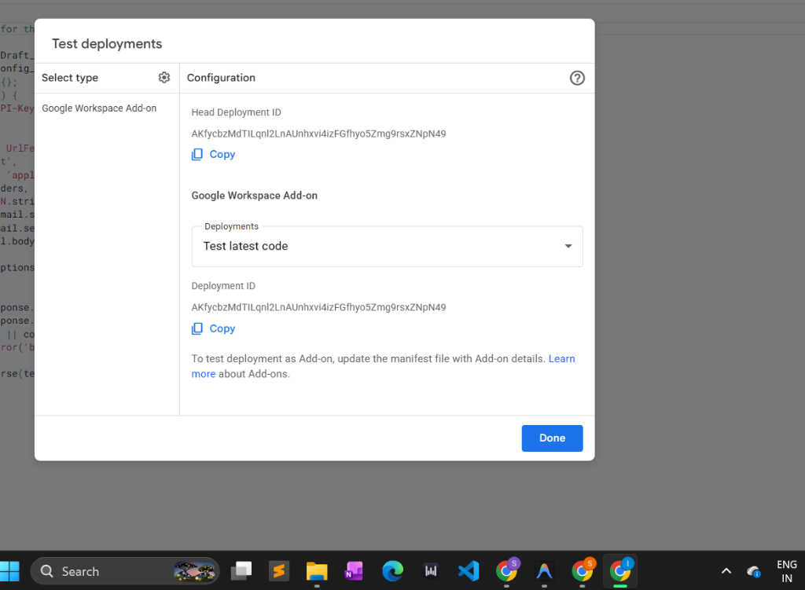

# sigfy RAG Layered Architecture



## System Diagram

```
                 PRESENTATION LAYER (Thin Client)
     ┌────────────────────────────────────────────────────────┐
     │                      Gmail Add-on                      │
     │  • Contextual Card UI        • Editable Reply Draft    │
     │  • Provenance Citations      • Manual Insertion Action │
     └──────────────────────────┬─────────────────────────────┘
                                │ JSON Payload
                                ▼
                          API / TRACE LAYER
     ┌────────────────────────────────────────────────────────┐
     │                   FastAPI (main.py)                    │
     │  • /draft              • /batch_draft                  │
     │  • /batch_draft_async  • /task_status/{id}             │
     │  • /task_cancel/{id}   • /health                       │
     │  • API shared-secret auth  • Privacy-aware request ID  │
     │  • Latency profiling metrics                           │
     └──────────────────────────┬─────────────────────────────┘
                                │
                                ▼
                        RETRIEVAL LAYER
     ┌────────────────────────────────────────────────────────┐
     │                  Retriever (retrieval.py)              │
     │  • Metadata-guided filtering with automatic fallback   │
     │  • Stopword-filtered BM25    • Dense semantic search   │
     │  • Reciprocal Rank Fusion (RRF) ranking                │
     └──────────────────────────┬─────────────────────────────┘
                                │
                                ▼
                    EVIDENCE VALIDATION GATE
     ┌────────────────────────────────────────────────────────┐
     │               validate_evidence helper                 │
     │  • Multi-signal dense & lexical scoring validation     │
     │  • Pass: Proceed to Response Generation                │
     │  • Reject: Bypasses LLM, immediately returns Not Found │
     └────────────────────────┬───────────────────────────────┘
                              │ Valid Evidence
                              ▼
                       GENERATION LAYER
     ┌────────────────────────────────────────────────────────┐
     │                 Generator (generate.py)                │
     │  • Grounded Response Generation (Groq LLM)             │
     │  • Provenance citation compiler                        │
     └────────────────────────┬───────────────────────────────┘
                              │
                              ▼
                        KNOWLEDGE LAYER
     ┌────────────────────────────────────────────────────────┐
     │                Pre-computed Plan Index                 │
     │  • Offline chunks.json       • Cached embeddings.npy   │
     │  • Chunks generated offline; query embedded online     │
     └────────────────────────────────────────────────────────┘
```

---

## Detailed RAG Execution Flow

### 1. Ingestion vs. Query-Time Embeddings
To keep query latency low (`< 15ms` for retrieval), expensive vector embedding generation is split:
- **Offline Ingestion (`ingest.py`)**: PDFs are parsed, windowed into ~1,100-character chunks on sentence boundaries, embedded locally in batches using `SentenceTransformer (BAAI/bge-small-en-v1.5)`, and saved to `embeddings.npy`.
- **Online Query-Time**: Only the single incoming query is embedded dynamically. Vector similarity is run as a direct numpy matrix dot product (flat index) on CPU.

### 2. Lexical RRF Bias
Hybrid RRF assigns a higher weight to BM25 (`1.5`) than Dense similarity (`1.0`). Exact term matches (such as a specific limit like `"$3,300"`, copays, and carrier names) are far more reliable in insurance contexts than semantic embeddings, which can suffer from noise.

### 3. Stopword Filtering
Before lexical indexing and query search, common prepositions and conjunctions (e.g. *what*, *is*, *the*, *of*, *it*) are filtered. This prevents nonsense queries or general conversational text from artificially inflating BM25 scores.

### 4. Evidence Confidence Signal (formerly Hard Gate)
The evidence validator scores the top retrieved chunk against configurable thresholds. Rather than hard-blocking the LLM, it now acts as a **confidence signal**:
- **Strong evidence** (`dense >= val_dense_threshold AND bm25 >= val_bm25_minimal`, or one very-high single-signal): LLM is called and confidence defaults to what the LLM reports.
- **Weak evidence** (thresholds not met): LLM is **still called** with the best available chunks. A `[Low evidence]` note is appended to the response and confidence is capped at `"low"`. The LLM's own prompt rules handle edge cases (expired plans, closed enrollment windows) correctly.
- *Rationale*: Hard-blocking the LLM on weak evidence caused some emails (e.g., "Enrolling in long-term care insurance") to silently return a generic placeholder instead of a well-reasoned reply explaining the plan closed in 2019. The signal approach preserves cost-savings intent while ensuring every email receives a meaningful draft.
- *Thresholds* are configurable via environment variables (`VAL_DENSE_THRESHOLD`, `VAL_BM25_MINIMAL`, `VAL_DENSE_VERY_HIGH`, `VAL_BM25_STRONG`).


### 5. Metadata-Guided Retrieval with Fallback
When a query is received, **sigfy** scans the text for keywords corresponding to specific plans in `PLAN_DOCS` (e.g., "braces" matching the Dental plan).
- **Execution**: The search preferentially searches the detected document set and automatically falls back to the full corpus when evidence is weak. This prevents accidental misses when plan names are omitted while drastically reducing noise for clear queries.

### 6. Provenance-Rich Citations
Citations are compiled with complete self-contained metadata that separates user-facing presentation from internal debugging tools:
- **Visible fields**: `document`, `section`, `page`, `quote`.
- **Internal debugging fields**: `chunk_id`, `retrieval_score`, `effective_date`.

### 7. Privacy-Aware Tracing & Latency Metrics
To comply with standard PII (personally identifiable information) guidelines, the FastAPI console logs **never** write the raw query text or private email bodies. Instead, it logs a request ID hash, retrieved chunk IDs, scores, gate decisions, LLM status, and latency profiling metrics (time in milliseconds for embedding, dense, BM25, and LLM).
